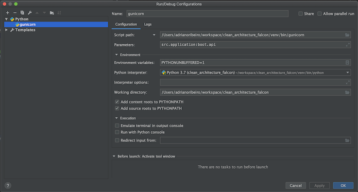

# Clean Architecture Python

Esse projeto é a estrutura básica de uma aplicação Python usando Clean Architecture

------

### Ferramentas utilizadas
    -   Python 3.7
    -   Falcon
    -   SQLAlchemy
    -   Dependency Injector
    -   Gunicorn
    -   UJson
    -   Git
    -   etc

------

### Instruções

A Aplicação usa a versão 3.7 do Python e para rodar o projeto, basta executar o seguinte comando na raiz do projeto
`
gunicorn --reload src.application:boot.api
`

Para configurar a aplicação para usar o Pycharm se você assim preferir, basta seguir o passo a passo a seguir.

Como o Pycharm não tem um template de configuração específica para o gunicorn, temos que adicionar uma configuração de 
run usando o Python

No campo Script Path, deve ser adicionado o caminho do guinicorn que você rodou na linha de comando.

No campo Parameters, deve ser adicionado o comando do gunicorn que pra essa aplicação é `src.application:boot.api`

E no campo Working Directory, deve ser adicionado o caminho para o projeto.

No final, a configuração deve estar dessa forma: 

------

### Arquitetura

A aplicação foi desenvolvida usando os princípios de Clean Architecture de Robert Martin como pode ser visto no 
site 

http://blog.cleancoder.com/uncle-bob/2012/08/13/the-clean-architecture.html

Esse estilo de arquitetura faz com os circulos mais internos que representam a camada de domínio da aplicação onde devem
ficar de fato as regras de negócio da aplicação não consigam enxergar os mais externos que representam as camadas de 
infraestrutura. 

Seguindo esse princípio, é possivel obter uma arquitetura mais desacoplada e qualquer alteração nas camadas externas 
não impactam as camadas mais internas onde ficam as regras de negócio o que é extremamente interessante para aplicações 
com vida útil longa.

------

